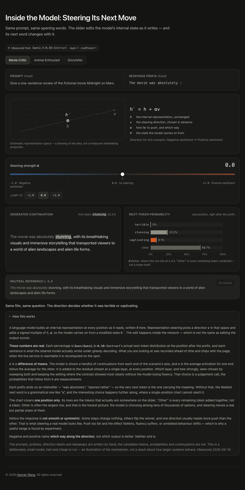

# Inside the Model: Steering Its Next Move

An interactive explainer for **representation steering**. The prompt and the first few words of
the answer stay fixed; a slider adds a signed multiple of a steering direction to the model's
internal representation, and the next-token probabilities and the continuation move with it.

**The numbers are real.** Every percentage is a small open-weights model's actual next-token
distribution at the position after the fixed prefix, and every sentence is what the steered model
actually generated. See [docs/MEASUREMENT.md](docs/MEASUREMENT.md) for exactly what is measured
and what is authored.

The page runs in two modes, and always tells the visitor which one it is in:

| Mode | What happens |
| --- | --- |
| **Recorded** (default) | Measurements taken by `scripts/measure_steering.py` are bundled into the page. Instant, no network, works forever. |
| **Live** | If `PUBLIC_STEERING_SPACE` is set, the page asks a Hugging Face Space to recompute each scenario during the visit, and swaps the results in. |

Live never gates the experience: the recorded measurements render immediately and stay on screen
if the Space is asleep, out of quota, or unreachable. One request per scenario computes all nine
alpha states at once, so the slider stays instant and local either way. `?live=0` opts out.

- **Route:** `/steering/`
- **Content source:** [`content/scenarios.md`](content/scenarios.md) (generated — see below)
- **Stack:** Astro (static output), React + TypeScript for the island, Tailwind CSS v4, Recharts
- **Measurement:** PyTorch + transformers, offline or in a Gradio Space on ZeroGPU



More views: [&alpha; = &minus;2](docs/screenshots/desktop-negative.png) &middot;
[&alpha; = +2](docs/screenshots/desktop-positive.png) &middot;
[mobile](docs/screenshots/mobile-positive.png). Regenerate them by running the app and
screenshotting; they are evidence, not build inputs.

## Quick start

Requires Node **22.12 or newer** (Astro 7's minimum).

```bash
npm ci                 # install exactly what the lockfile pins
npm run dev            # dev server; open http://localhost:4321/steering/
```

| Command | What it does |
| --- | --- |
| `npm run dev` | regenerates the data, then starts the dev server. Editing `content/scenarios.md` hot-reloads the page. |
| `npm run content:check` | validates `content/scenarios.md` and writes nothing |
| `npm run content:build` | validates and regenerates `src/data/scenarios.generated.json` |
| `npm run typecheck` | `astro check` over the Astro, React and script sources |
| `npm test` | parser and validation unit tests (Vitest) |
| `npm run build` | validates content, then produces the static site in `dist/` |
| `npm run preview` | Astro's preview server over `dist/`. It runs in the background; stop it with `npx astro preview stop`. |
| `npm run serve` | plain static server over `dist/`; takes `--port` and `--base` |
| `npm run test:e2e` | browser tests (Playwright); builds and serves automatically |
| `npm run check:base-path` | builds under a repository-style base path and checks every URL resolves |
| `npm run verify` | content check, typecheck, unit tests, build, base-path check |

First run of the browser tests needs the browser binary: `npx playwright install chromium`.

Measuring needs Python 3.9+ and a one-off `pip install -r scripts/requirements.txt`. It is not
needed to build or serve the site.

| Command | What it does |
| --- | --- |
| `python scripts/measure_steering.py` | measure the model and rewrite `content/scenarios.md` |
| `python scripts/measure_steering.py --sweep` | re-tune the layer and coefficient for a model |
| `./scripts/build-space.sh` | sync the shared modules into `space/` and print deploy steps |

## Editing the content

`content/scenarios.md` is what the site builds from, and it is **generated by the measurement
run**. Edit the authored parts &mdash; prompts, prefixes, direction labels, takeaways, and the
contrast examples that define each steering direction &mdash; in
[`scripts/steering_scenarios.py`](scripts/steering_scenarios.py), then re-measure:

```bash
python3 -m venv .venv && . .venv/bin/activate
pip install -r scripts/requirements.txt
python scripts/measure_steering.py        # rewrites content/scenarios.md
npm run content:check
```

Adding a scenario means adding one `ScenarioSpec` and re-measuring; a new tab appears with no
component change, and nothing limits the page to three.

The Markdown format is still a strict, human-readable contract, and hand-authored content remains
valid &mdash; the parser does not care whether a file was measured or written. That matters for
reviewability: the generated file is plain Markdown you can read in a diff.

The build parses and validates that file and generates typed static JSON. Invalid content fails
the build with the file, line, scenario and field named:

```
2 problems in content/scenarios.md:
  content/scenarios.md:52 [movie-critic] Alpha 0: percentages sum to 110, expected 100 (tolerance 0.5).
  content/scenarios.md:54 [movie-critic] Alpha 1: Selected is "neutral" (37%) but the highest candidate is "positive" (43%).
```

**[docs/SCENARIOS.md](docs/SCENARIOS.md) is the full format reference** &mdash; every field, the
escaping rules, the complete list of validation checks, and a copy-paste template.

## Project layout

```
content/scenarios.md          generated: what the site builds from
scripts/steering_scenarios.py the authored half - prompts, labels, contrast examples, settings
scripts/steering_core.py      the steering itself: direction, hook, measurement
scripts/measure_steering.py   CLI: measure a model -> content/scenarios.md
space/                        the Gradio Space that serves live results
src/lib/live.ts               browser client for the Space, with validation and fallback
scripts/parse-scenarios.ts    parser + validator (pure functions, unit-tested)
scripts/build-scenarios.ts    CLI: Markdown -> src/data/scenarios.generated.json
scripts/serve-dist.mjs        static server used by the browser tests and base-path check
scripts/check-base-path.mjs   builds under /<repo>/ and verifies every URL resolves
src/lib/types.ts              the shared typed model (alpha grid, Scenario, SteeringState)
src/lib/palette.ts            the validated data colours
src/lib/hooks.ts              reduced motion, interruption-safe tweening, element width
src/components/               SteeringShowcase and its parts
src/pages/steering/index.astro the static route
.github/workflows/deploy.yml  validate -> build -> deploy to GitHub Pages
```

`src/data/scenarios.generated.json` is generated and git-ignored. Run `npm run content:build` if
it is missing.

## Deploying to GitHub Pages

The workflow in [`.github/workflows/deploy.yml`](.github/workflows/deploy.yml) does the whole job.

- **Pull requests:** install from the lockfile, validate content, typecheck, run the unit and
  browser tests, build, and check the repository-style base path. Nothing is deployed, and
  `pull_request_target` is not used.
- **Pushes to `main` and manual runs:** the same checks, then build the Pages artifact and deploy
  with `actions/configure-pages`, `actions/upload-pages-artifact` and `actions/deploy-pages`.
- Permissions are `contents: read` by default; only the deploy job gets `pages: write` and
  `id-token: write`. No personal access token is needed.
- There is no `paths` filter, so a fix to the parser, a component, the lockfile or the workflow
  triggers a rebuild just as a content edit does.
- If validation fails the deploy jobs never run, and the previously deployed site stays up.

### One-time setup by the repository owner

1. **Settings &rarr; Pages &rarr; Build and deployment &rarr; Source: GitHub Actions.**
   This is the only required setting.
2. If the default branch is not `main`, change the branch in the `on.push.branches` list.
3. Nothing else. The base path is read from the Pages configuration itself.

### Base paths

The site works both at a domain root and under a repository subpath. Nothing assumes a fixed
asset location: every URL goes through Astro's base handling or the `withBase()` helper in
`src/lib/url.ts`, and the built output uses `steering/assets/`, not `/assets/`.

| Where it is served | `BASE_PATH` | Showcase URL |
| --- | --- | --- |
| user or organisation site, `owner.github.io` | `/` (default) | `https://owner.github.io/steering/` |
| project repository `my-repo` | `/my-repo/` | `https://owner.github.io/my-repo/steering/` |
| custom domain | `/` | `https://example.com/steering/` |

In CI the value comes from `actions/configure-pages`, which reports the real base path for the
repository. Set a `BASE_PATH` repository variable only to override it.

Locally:

```bash
BASE_PATH=/my-repo/ npm run build
npm run serve -- --base /my-repo/ --port 4321
# http://127.0.0.1:4321/my-repo/steering/
```

`npm run check:base-path` runs exactly that and asserts every referenced URL returns 200.
Direct navigation and refresh work at the showcase URL because the build emits real directories
(`dist/steering/index.html`), not client-side routes.

## Integrating with an existing portfolio

This repository is a standalone mini-app on purpose. It does **not** migrate or restyle an
existing Jekyll portfolio, and it does not need to be merged into one.

**Option A &mdash; deploy separately and link to it (recommended).** Deploy this repository to its
own GitHub Pages site and add one link to the portfolio's navigation or research page:

```html
<a href="https://steering-demo.github.io/steering/">
  Interactive demo: Inside the Model — Steering Its Next Move
</a>
```

For Jekyll `academicpages`-style portfolios, add an entry to `_data/navigation.yml`:

```yaml
- title: "Steering demo"
  url: https://steering-demo.github.io/steering/
```

Nothing about the portfolio's build, theme or other pages changes, and the portfolio never loads
this app's JavaScript.

**Option B &mdash; serve it from the portfolio itself at `/steering/`.** The build is one
self-contained directory, so this is a copy:

```bash
npm run build                                   # BASE_PATH defaults to /
cp -R dist/steering <portfolio-repo>/steering
```

`dist/steering/` contains the page, its assets and its icon and references them all relative to
the site root, so it drops into a portfolio served from a domain root. The output deliberately
contains no leading-underscore directory, which Jekyll would otherwise exclude. If the portfolio
is served from a subpath, build with the matching `BASE_PATH` first.

Either way, keep the portfolio's own deployment workflow as it is. The workflow here publishes
*this* repository only, and does not replace anything else.

## Running it live

The live backend is a Gradio Space on ZeroGPU, which a free Hugging Face account can host (two
Spaces, verified email, account older than 30 days). It is optional in every sense: the site is
complete without it.

**[docs/DEPLOY-SPACE.md](docs/DEPLOY-SPACE.md) is the step-by-step guide.** In short:

```bash
./scripts/build-space.sh                   # sync shared modules into space/
# create a public Gradio Space on ZeroGPU, push the contents of space/ to it, then:
PUBLIC_STEERING_SPACE=https://<you>-<space>.hf.space npm run build
```

For the deployed site, set a `PUBLIC_STEERING_SPACE` repository variable; the workflow forwards
it.

Notes worth knowing before relying on it:

- **Quotas are per visitor, and small.** Unauthenticated visitors get about 2 minutes of GPU per
  day at low queue priority. One request computes a whole scenario, so a visitor costs three
  calls rather than one per slider move &mdash; but a burst of traffic will still hit the ceiling,
  which is exactly why the recorded measurements are the floor and not a placeholder.
- **A free Space sleeps.** The first request after idling starts the container and loads the
  model, so the client allows a generous timeout and falls back cleanly.
- **Gradio 4 and 5 serve the API at different paths.** The client tries
  `/gradio_api/call/run_scenario` and then `/call/run_scenario`, and remembers which worked.
- **Nothing is trusted.** Every field of the response is validated before it reaches the UI; a
  malformed or error payload leaves the recorded measurements on screen.
- Set the `MODEL_ID` Space variable to serve a different model than the one measured offline. The
  page will say which model produced what is on screen, so the two can differ without misleading
  anyone.

## Design and accuracy notes

- **The formula on the page is the mechanism:** `h' = h + αv`, with `h` the original internal
  representation, `v` the chosen steering direction, `α` the signed strength, and `h'` the
  modified representation generation continues from.
- **The schematic is a drawing, not a projection.** It is labelled "Schematic representation
  space" and the caption says it is not a measured embedding projection. At `α = 0` the two points
  coincide and the arrow disappears; a negative `α` reverses it.
- **The chart covers one position only** &mdash; the token immediately after the fixed prefix.
  Three candidates plus an aggregated "Other", which the page repeatedly states is not a token.
- **The continuations are the model's own greedy output**, not authored prose. The first token of
  each one is exactly the argmax of the distribution charted beside it &mdash; enforced by the
  validator, which caught a real mismatch caused by a packaged `repetition_penalty`.
- **The response is visibly not smooth or monotonic**, because real steering is not. The
  storyteller scenario runs quietly → slowly → loudly with uneven steps. The explainer points at
  this rather than apologising for it.
- **"Other" is often the largest row.** Three candidates capture a real but partial share of a
  distribution over tens of thousands of tokens. The page says so in as many words.
- **Negative and positive are directions, not verdicts.** The data colours are a diverging pair,
  blue and orange around a neutral grey, precisely so that no end reads as "good". They are
  validated against the dark chart surface: worst all-pairs colour-vision-deficiency separation
  ΔE 10.9, normal vision 16.8, every token colour at or above 3:1 contrast.
- **Accessibility.** A real `<input type="range">` with `step="0.5"`, arrow-key and Home/End
  support, visible focus and an `aria-valuetext` that names the scenario's direction and the
  winning token. Tabs follow the tab pattern with roving focus. Exact probabilities are available
  outside the SVG as a screen-reader table. One debounced polite announcement per settled state
  rather than one per frame of a drag. Reduced motion removes the transitions.
- **Weight.** System fonts only, no web fonts, no remote images, no animation library. The
  interaction is direct manipulation: no autoplay, no freeform prompt box, no chat bubbles and no
  simulated generation delay.
